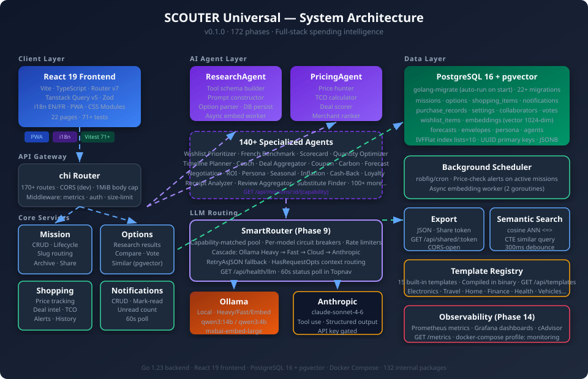
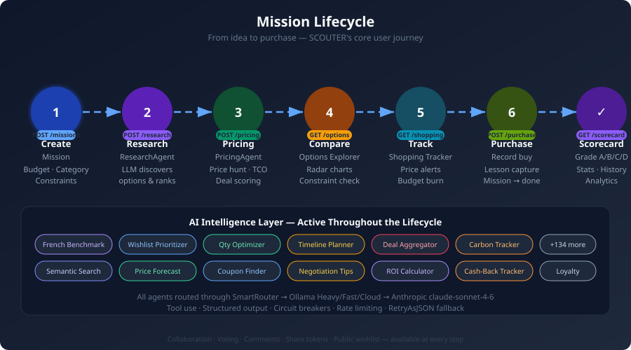
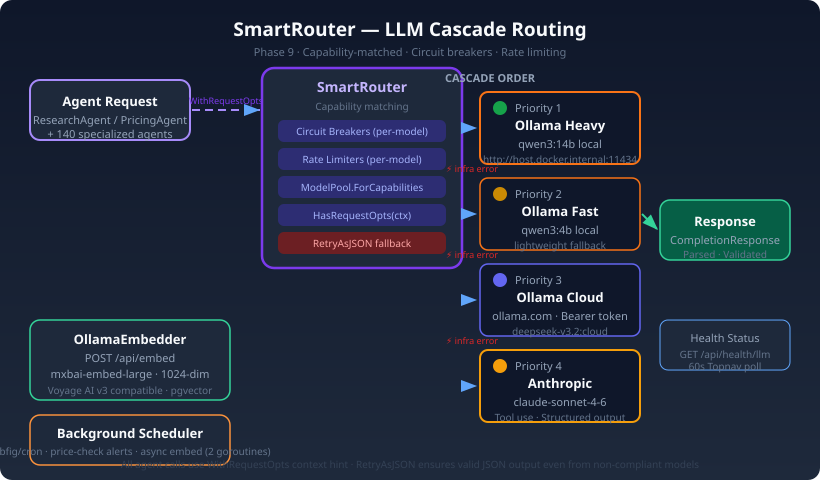
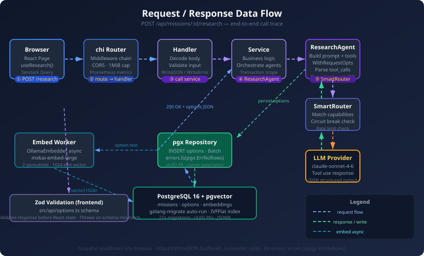
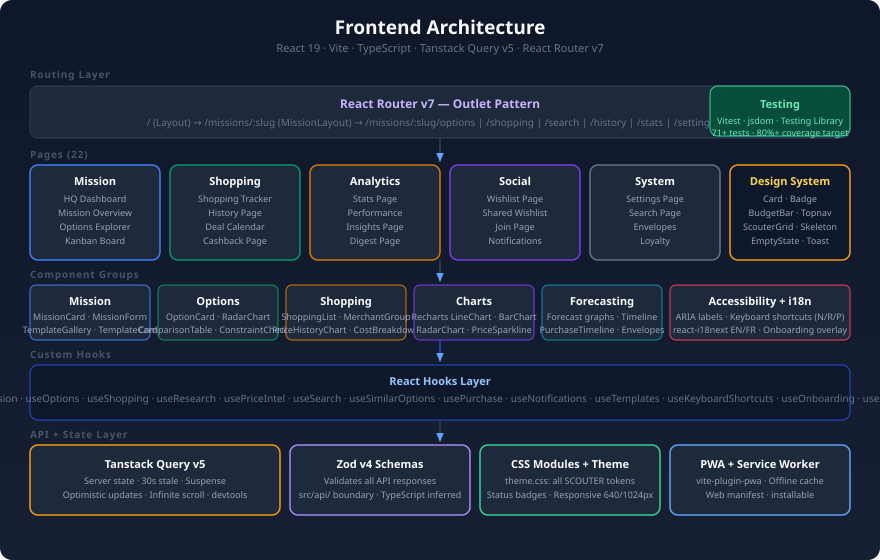

# SCOUTER Universal — Documentation

> Full-stack personal spending intelligence tool. Research, compare, and budget any major purchase.
> **v0.1.0** — 172 phases complete.

---

## Documentation Map

### For Users & Operators

| Section | Description |
|---------|-------------|
| [Quick Start](deployment/quickstart.md) | Get running in 5 minutes with Docker Compose |
| [Functional Overview](functional/overview.md) | Feature catalog and use cases |
| [User Guide](functional/user-guide.md) | Complete end-to-end walkthrough |
| [Runbook](../RUNBOOK.md) | Operational guide, troubleshooting, monitoring |
| [Environment Variables](deployment/environment.md) | Configuration reference |
| [Monitoring](deployment/monitoring.md) | Prometheus + Grafana setup |

### For Developers

| Section | Description |
|---------|-------------|
| [Contributing](development/contributing.md) | Dev workflow, TDD, coding conventions |
| [Testing](development/testing.md) | Unit, integration, E2E test strategy |
| [System Architecture](technical/architecture.md) | High-level design and component interactions |
| [API Reference](technical/api.md) | All 170+ endpoints with examples |
| [Backend Deep Dive](technical/backend.md) | Go packages, patterns, agents |
| [Frontend Deep Dive](technical/frontend.md) | React architecture, state management |
| [Database Schema](technical/database.md) | Tables, migrations, indexes, pgvector |
| [LLM Routing](technical/llm-routing.md) | Provider selection, circuit breakers, fallbacks |

---

## Quick Reference

**New to SCOUTER?** Start with [Quick Start](deployment/quickstart.md) (5 minutes).

**Trying to understand the code?** Read [Codemaps](CODEMAPS.md) first — it has navigation guides.

**Operating in production?** Check [Runbook](RUNBOOK.md) for monitoring, backups, troubleshooting.

**Running into issues?** See [Troubleshooting](RUNBOOK.md#troubleshooting) in the runbook.

---

## Diagrams

| Diagram | Description |
|---------|-------------|
|  | Full system overview |
|  | User journey from idea to purchase |
|  | SmartRouter cascade routing |
|  | Request/response trace through all layers |
|  | React component tree + state |

---

## At a Glance

```
Go 1.23 backend     132 internal packages   170+ API routes
React 19 frontend   22 pages                71+ tests
PostgreSQL 16       22+ migrations          pgvector 1024-dim
172 phases done     140+ AI agents          Docker Compose
```

## Tech Stack

| Layer | Technology |
|-------|------------|
| Backend | Go 1.23 · chi router · pgx/v5 · golang-migrate |
| Frontend | React 19 · TypeScript 5.9 · Vite 8 · React Router v7 · Tanstack Query v5 |
| Database | PostgreSQL 16 + pgvector (IVFFlat index) |
| LLM | Anthropic claude-sonnet-4-6 · Ollama (local) · SmartRouter |
| Validation | Zod v4 (frontend) · slog JSON logging (backend) |
| Testing | Vitest + Testing Library (frontend) · go test (backend) |
| Deployment | Docker Compose · Prometheus · Grafana · cAdvisor |
